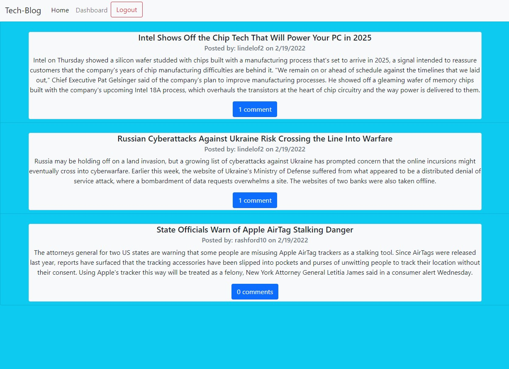

# Tech-Blog

## Questions
* GitHub User Name: [ryanweiler92](https://github.com/ryanweiler92)
* Repository Link: [Tech-Blog](https://github.com/ryanweiler92/Tech-Blog)
* Application Link: [Tech-Blog](https://fierce-fjord-67375.herokuapp.com)
* For any additional questions please reach out to ryanweiler92@gmail.com.

## Description
This application allows many users to create a username and password to create, edit & comment on posts. Users can quickly access their post history on their personalized dashboard.   

## Table of Contents
* [Installation](#installation)
* [Usage](#usage)
* [Contributors](#contributors)
* [Tests](#tests)
* [License](#license)

## Installation
No installation is required. Simply access the application link above and use the application from the browser.

## Usage

## Contributors
Ryan Weiler

## Tests 
No testing available at this time.

## License
  